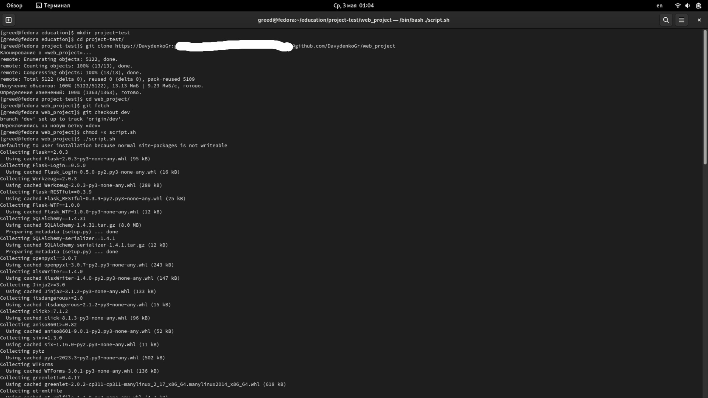
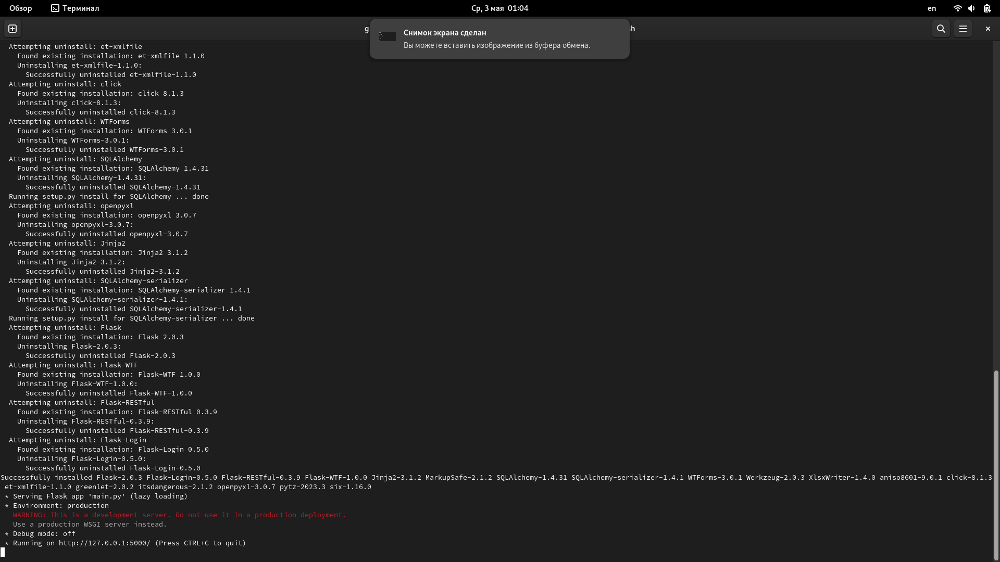
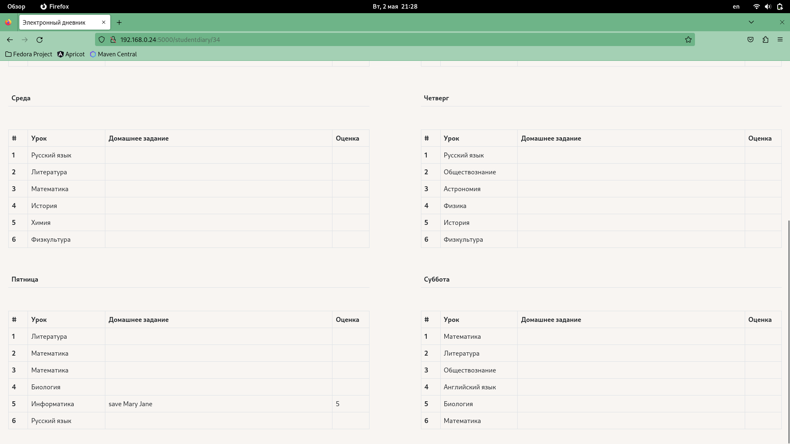

# Electronic-Diary
### About project

Electronic diary is a convenient intermediary between a teacher and a student,
which allows you to quickly track changes in the state of your schooling process.  

### Requirements

- python version 3+
- pip
- installed libraries from requirements.txt

### Start application 

Open your working directory in terminal and run next commands

```
git clone https://<YOUR_GITHUB_LOGIN>:<YOUR_TOCKEN>@github.com/DavydenkoGr/web_project
cd web_project
chmod +x script.sh
./script.sh
```

Open next URL in your browser:

```
http://localhost:5000
```

*NOTICE: if you want to change host or port, you may specify them in the script.sh*  

Now start using web diary as it shown in the following examples:

### Usage example

#### Terminal commands




#### Student

  
  


#### Teacher

  
  


You can check other available functions and pages

### Authors:
- *Davydenko Grigorii*
  - GitHub: *@DavydenkoGr*
  - Telegram: *@desertSmoke42*
